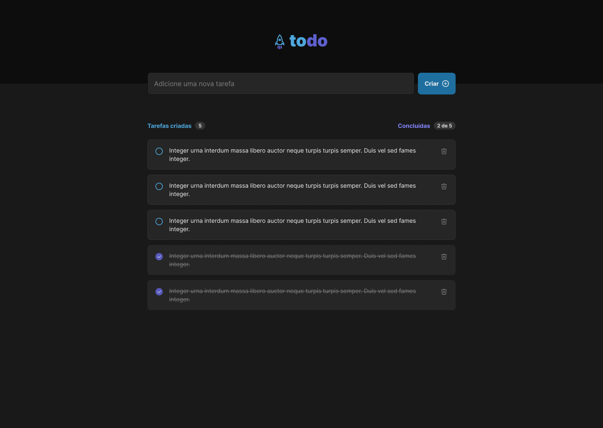

# Aplicação de Tarefas (Todo) com Next.js, Tailwind CSS, SQLite e Prisma


 <br />
 <br />
 <br />
# Sobre

Esta é uma aplicação de lista de tarefas simples que permite aos usuários adicionar, editar, marcar como completa e apagar tarefas. A aplicação foi construída usando Next.js para o frontend, Tailwind CSS para o design, e SQLite com o ORM Prisma para armazenar os dados das tarefas.




## Pré-requisitos

Antes de começar, certifique-se de ter o Node.js e o npm instalados em seu sistema. Você pode baixá-los em [nodejs.org](https://nodejs.org/).

## Como Clonar e Executar o Projeto Localmente

1. Clone o projeto

```bash
git clone https://github.com/andrelinos/new-todo.git
```

2. Acesse a pasta do projeto clonado

```bash
cd new-todo
```

3. Instale as dependências

```bash
npm install
# ou
yarn install
# ou
pnpm install
```

4. Crie o banco de dados SQLite e execute as migrações com o Prisma:

```bash
npx prisma migrate dev
# ou
yarn prisma migrate dev
# ou
pnpm prisma migrate dev
```

5. Inicie a aplicação em modo de desenvolvimento:

```bash
npm run dev
# ou
yarn dev
# ou
pnpm run dev
```

6. Acesse a aplicação em seu navegador em [http://localhost:3000](http://localhost:3000).

Agora você deverá ver a aplicação de lista de tarefas em funcionamento e poderá começar a adicionar, editar, marcar como completa e apagar tarefas.

Qualquer dúvida, pode falar comigo em [https://andrelino.dev](andrelino.dev)
